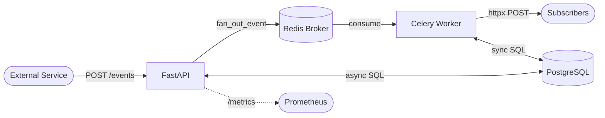
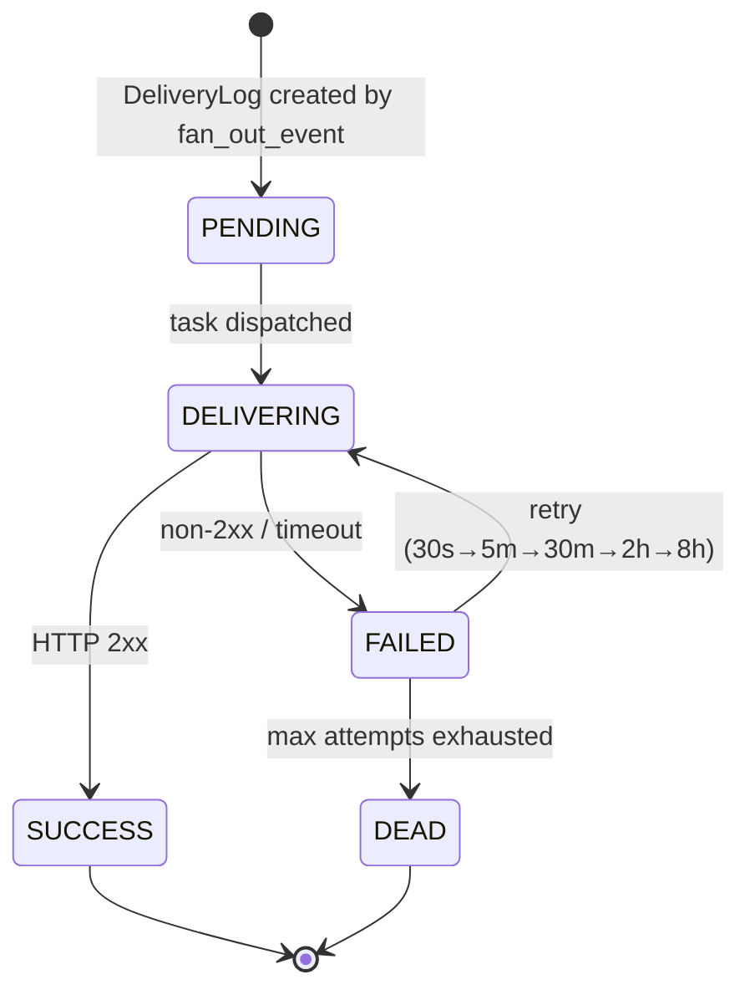

# Webhook Delivery Service

A production-grade async webhook delivery system in Python. Accepts incoming events via a REST API, fans out to registered subscriber endpoints, retries failed deliveries with exponential backoff, tracks every delivery attempt per subscriber, and exposes full observability via Prometheus.

---

## Architecture



### Delivery State Machine



---

## Stack

| Layer | Technology |
|---|---|
| Language | Python 3.12 |
| Framework | FastAPI |
| Task Queue | Celery |
| Broker / Backend | Redis 7 |
| Database | PostgreSQL 16 |
| ORM | SQLAlchemy 2.0 (async + sync) |
| Migrations | Alembic |
| Auth | JWT (`python-jose`) |
| Observability | Prometheus (`prometheus-fastapi-instrumentator`) |
| HTTP Client | httpx |
| Containerisation | Docker + Docker Compose |
| Testing | pytest + pytest-asyncio + httpx |

---

## Quick Start

### Prerequisites

- Docker ≥ 24 and Docker Compose V2
- Python 3.12+ (for local development without Docker)

### 1 — Clone and configure

```bash
git clone https://github.com/<your-org>/webhook-delivery.git
cd webhook-delivery
cp .env.example .env
# Edit .env — at minimum set JWT_SECRET to a random value:
python -c "import secrets; print(secrets.token_hex(32))"
```

### 2 — Start the full stack

```bash
docker compose -f docker/docker-compose.yml up -d
```

This starts: PostgreSQL, Redis, the FastAPI API server, and a Celery worker.

### 3 — Apply migrations

```bash
docker compose -f docker/docker-compose.yml exec api alembic upgrade head
```

### 4 — Verify health

```bash
curl http://localhost:8000/health
# {"status":"ok","db":"ok","redis":"ok"}
```

### 5 — Get an auth token

```bash
TOKEN=$(curl -s -X POST http://localhost:8000/auth/token | jq -r .access_token)
```

### 6 — Register a subscriber

```bash
curl -s -X POST http://localhost:8000/subscribers \
  -H "Authorization: Bearer $TOKEN" \
  -H "Content-Type: application/json" \
  -d '{
    "name": "my-service",
    "url": "https://webhook.site/your-unique-id",
    "event_types": ["order.created"],
    "enabled": true
  }' | jq .
```

### 7 — Ingest an event

```bash
curl -s -X POST http://localhost:8000/events/ \
  -H "Authorization: Bearer $TOKEN" \
  -H "Content-Type: application/json" \
  -d '{
    "event_type": "order.created",
    "payload": {"order_id": 42, "total": 99.99}
  }' | jq .
# {"event_id":"<uuid>","status":"queued"}
```

The worker fans out and POSTs the payload to your subscriber URL within seconds.

### 8 — Check delivery status

```bash
# Replace <event_id> with the uuid from step 7
curl -s http://localhost:8000/events/<event_id> \
  -H "Authorization: Bearer $TOKEN" | jq .deliveries
```

---

## Environment Variables

All variables are read from `.env` (or the shell environment). Copy `.env.example` to `.env` to get started.

| Variable | Required | Default | Description |
|---|---|---|---|
| `DATABASE_URL` | ✅ | — | Async PostgreSQL URL (`postgresql+asyncpg://...`), used by FastAPI |
| `SYNC_DATABASE_URL` | ✅ | — | Sync PostgreSQL URL (`postgresql+psycopg2://...`), used by Celery |
| `REDIS_URL` | ✅ | `redis://localhost:6379/0` | Redis broker + result backend URL |
| `JWT_SECRET` | ✅ | — | Secret key for signing JWTs. Generate with `python -c "import secrets; print(secrets.token_hex(32))"` |
| `PORT` | ❌ | `8000` | Port the API server listens on |
| `ACCESS_TOKEN_EXPIRE_MINUTES` | ❌ | `60` | JWT token lifetime in minutes |
| `MAX_DELIVERY_ATTEMPTS` | ❌ | `6` | Maximum delivery attempts before a log is marked `dead` |
| `RUN_MIGRATIONS_ON_START` | ❌ | `false` | Run `alembic upgrade head` automatically on startup (dev convenience only) |
| `TEST_DATABASE_URL` | ❌ | `postgresql+asyncpg://...webhooks_test` | Async URL for the test database (pytest only) |

---

## API Reference

All endpoints except `/health` and `/auth/token` require a `Bearer` JWT in the `Authorization` header.

| Method | Path | Auth | Status | Description |
|---|---|---|---|---|
| `GET` | `/health` | No | 200 / 503 | Readiness probe — checks DB and Redis connectivity |
| `POST` | `/auth/token` | No | 200 | Issue a service-to-service JWT |
| `GET` | `/auth/me` | Yes | 200 | Return decoded JWT claims |
| `POST` | `/subscribers` | Yes | 201 | Register a new webhook subscriber |
| `GET` | `/subscribers` | Yes | 200 | List all subscribers (paginated) |
| `GET` | `/subscribers/{id}` | Yes | 200 / 404 | Fetch a single subscriber |
| `PUT` | `/subscribers/{id}` | Yes | 200 / 404 | Partially update a subscriber |
| `DELETE` | `/subscribers/{id}` | Yes | 204 / 404 | Hard-delete a subscriber |
| `POST` | `/events/` | Yes | 202 | Ingest an event and enqueue fan-out |
| `GET` | `/events/{id}` | Yes | 200 / 404 | Fetch an event with its delivery log summaries |
| `GET` | `/deliveries/{id}` | Yes | 200 / 404 | Fetch a single delivery log row |
| `GET` | `/deliveries/{id}/retry` | Yes | 202 / 400 / 404 | Re-enqueue a `dead` delivery for another attempt |

Interactive documentation is available at:
- **Swagger UI**: `http://localhost:8000/docs`
- **ReDoc**: `http://localhost:8000/redoc`

---

## Running Tests

### Prerequisites

Start the dev containers (PostgreSQL on port 5433, Redis on port 6379):

```bash
docker compose -f docker/docker-compose.dev.yml up -d
```

Create a virtual environment and install dependencies:

```bash
python -m venv .venv
source .venv/bin/activate
pip install -r requirements.txt -r requirements-dev.txt
```

Apply migrations to the test database:

```bash
alembic upgrade head
```

### Unit tests (no live services needed)

```bash
pytest tests/unit/ -v
```

### Integration tests (requires dev containers)

```bash
pytest tests/integration/ -v -m integration
```

### Full suite with coverage

```bash
pytest tests/ --cov=app --cov-report=term-missing
```

Coverage must remain ≥ 85%. The current coverage is **≥ 97%**.

### Lint and type checks

```bash
ruff check .          # linter
ruff format .         # formatter
mypy app/             # type checker
```

---

## Project Structure

```
webhook-delivery/
├── app/
│   ├── api/
│   │   ├── routes/
│   │   │   ├── auth.py          # POST /auth/token, GET /auth/me
│   │   │   ├── deliveries.py    # GET /deliveries/:id, GET /deliveries/:id/retry
│   │   │   ├── events.py        # POST /events/, GET /events/:id
│   │   │   ├── health.py        # GET /health (readiness probe)
│   │   │   └── subscribers.py   # CRUD /subscribers
│   │   ├── deps.py              # FastAPI dependencies (db session, JWT guard)
│   │   ├── middleware.py        # Request-ID injection + access logging
│   │   └── openapi_examples.py  # Reusable OpenAPI request/response examples
│   ├── core/
│   │   ├── config.py            # pydantic-settings Settings class + singleton
│   │   ├── logging.py           # structlog JSON logging configuration
│   │   └── security.py          # JWT encode/decode + HMAC signing
│   ├── db/
│   │   ├── models.py            # SQLAlchemy 2.0 ORM models
│   │   ├── schemas.py           # Pydantic v2 request/response schemas
│   │   └── session.py           # Async engine (FastAPI) + sync session (Celery)
│   ├── observability/
│   │   └── metrics.py           # Prometheus counters and histograms
│   ├── services/
│   │   ├── delivery_service.py  # Event + DeliveryLog query helpers
│   │   └── subscriber_service.py# Subscriber CRUD business logic
│   ├── tasks/
│   │   ├── celery_app.py        # Celery instance + broker/backend config
│   │   ├── delivery.py          # deliver_webhook task (HTTP POST + retry logic)
│   │   └── fanout.py            # fan_out_event task (dispatch per subscriber)
│   └── main.py                  # FastAPI app factory + lifespan + middleware
├── alembic/
│   ├── versions/                # Auto-generated migration scripts
│   └── env.py                   # Async Alembic environment configuration
├── docker/
│   ├── Dockerfile               # API server image
│   ├── Dockerfile.worker        # Celery worker image
│   ├── docker-compose.yml       # Production-like full stack
│   ├── docker-compose.dev.yml   # Dev containers (Postgres + Redis only)
│   └── prometheus.yml           # Prometheus scrape config
├── docs/
│   ├── adr/                     # Architecture Decision Records
│   ├── ROADMAP.md               # TDD development roadmap
│   ├── SSOT.md                  # Single Source of Truth spec
│   └── runbook.md               # Operational runbook
├── scripts/
│   └── smoke_test.sh            # End-to-end smoke test script
├── tests/
│   ├── integration/             # Integration tests (require live Postgres + Redis)
│   └── unit/                    # Unit tests (fully mocked, no live services)
├── .env.example                 # Template for environment variables
├── .pre-commit-config.yaml      # Pre-commit hooks (ruff, mypy)
├── alembic.ini                  # Alembic configuration
├── CHANGELOG.md                 # Project changelog (Keep a Changelog format)
├── CONTRIBUTING.md              # Contributor guide
├── pyproject.toml               # Build config, ruff, mypy, pytest settings
├── requirements.txt             # Production dependencies
└── requirements-dev.txt         # Development / test dependencies
```

---

## License

MIT
